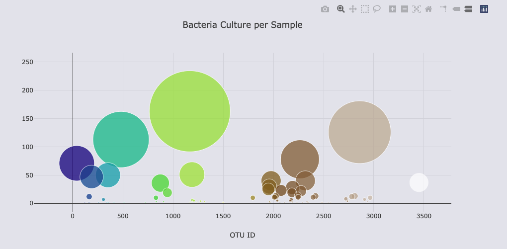

# Belly Button Biodiversity
Java Script and Plotly

</img>

## Overview of the Analysis
For this project we are identifying and cataloguing bacteria that have the ability to synthesize proteins that taste like beef. There are many participants in the study and we are creating a dashboard that will help the subjects (and others!) identify the bacteria found in their belly buttons using graphs from Plotly.

## Results

Using JavaScript, Plotly, Bootstrap and Git Hub pages, we are displaying the data for each subject on a convenient dashboard with a drop down menu to select the data for each participant id.

<a href="https://smjuni.github.io/BellyButtonChallenge/">BellyButtonBiodiversity</a>

